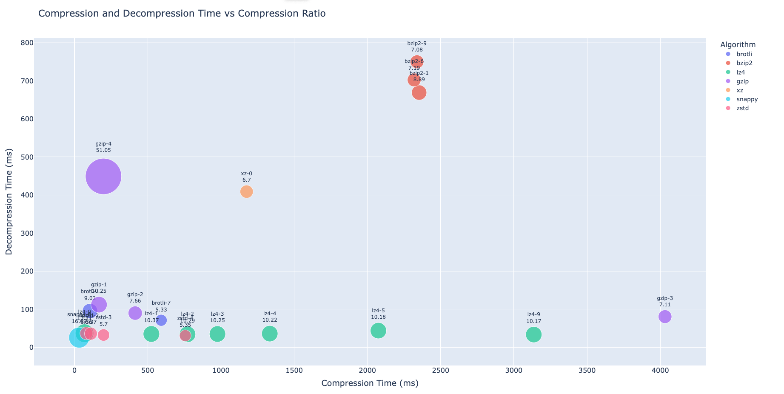
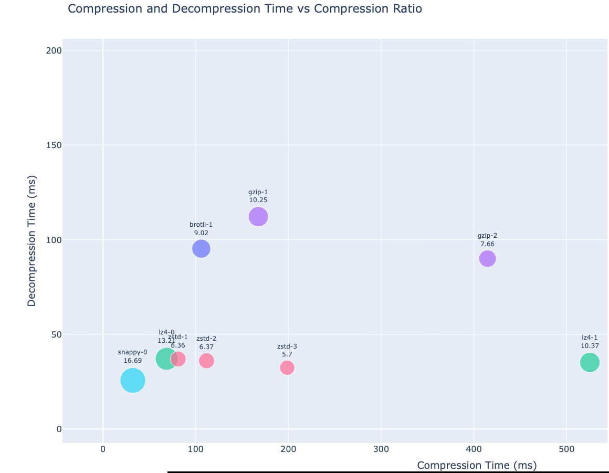

# run benchmark


```
cd compress-project
go mod tidy
go run benchmark.go --input ../eth_blocks --epoch 5
```
This will run all compression algorithms with each level (if supported) for epoch rounds, then generate logs and a final status csv file inside the ./temp used for analysis later.

this benchmark used 27 Ethereum blocks inside the eth_blocks as test dataset.
```
	"gzip":   {1, 2, 3, 4},
	"xz":     {0},
	"snappy": {0},
	"zstd":   {1, 2, 3, 4},
	"brotli": {1, 2, 3, 4, 5, 6, 7, 8},
	"bzip2":  {1, 6, 9},
	"lz4":    {0, 1, 2, 3, 4, 5, 9},
```

# Analysis
used this jupyter notebook:
[bubble_polit.ipynb](https://pikaz76.github.io/block-data/bubble_plot.ipynb)

Let's analysis the result using a this chart: [Analysis Chart](https://pikaz76.github.io/block-data/benchmark_interactive.html)

[](https://pikaz76.github.io/block-data/benchmark_interactive.html)

we can zoom in:

[](https://pikaz76.github.io/block-data/benchmark_interactive.html)

As shown in the chart, **snappy, lz4 (level 0), and zest (level 1)** all perform well in terms of both compression/decompression time and compression efficiency in this test.

Note: This test did not include memory usage metrics.
